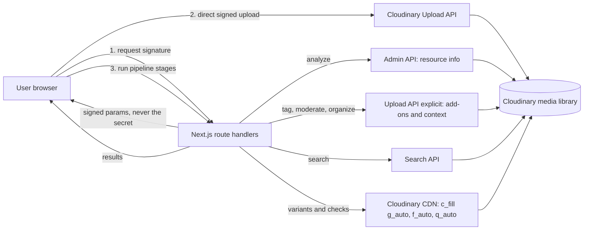

# MediaFlow AI

> **Upload once. AI understands, organizes, transforms and delivers your media.**

Built by **Team_Hydra** for the Cloudinary Hackathon, **PS-04 · Track 1 — AI Media Pipelines**.

## Problem

Teams ship the same image or video to a website, Instagram, Stories and thumbnails. Today that means manual
cropping, manual tagging, manual compression and a folder of near-duplicate files nobody can search.

## Solution

MediaFlow AI is an automated, end-to-end media pipeline built on Cloudinary. One upload triggers eight visible stages:
ingest, analyze, tag, moderate, organize, transform, optimize and deliver. The result is searchable, structured,
platform-ready media delivered through optimized Cloudinary URLs, with no duplicate files to manage.

## Why Cloudinary

- **One platform** for upload, AI add-ons, transformations, search and CDN delivery, so there is no database to run.
- **URL-based transformations**: variants are not stored copies. They are generated on demand from the original.
- **Content-aware cropping** (`c_fill` + `g_auto`) and **automatic format and quality** (`f_auto`, `q_auto`).
- **Search API and contextual metadata** make processed assets queryable without extra infrastructure.

## Architecture



The API secret exists only in server-side route handlers (`src/lib/cloudinary/*` is marked `server-only`).
The browser uploads straight to Cloudinary using a short-lived signature.

## Pipeline

| Stage | What actually happens | Requires |
|---|---|---|
| **INGEST** | Signed browser upload to Cloudinary. The asset is tagged `mediaflow` and restricted to allowed formats. | Cloudinary credentials |
| **ANALYZE** | Admin API read of dimensions, format, size and tags. Only assets tagged `mediaflow` are served. | — |
| **TAG** | Auto-tagging through a Cloudinary add-on (images only). Tags are shown as returned. | Add-on + `CLOUDINARY_TAGGING_ADDON` |
| **MODERATE** | Moderation through a Cloudinary add-on (images only). Result is approved, rejected or pending (shown as review). | Add-on + `CLOUDINARY_MODERATION_ADDON` |
| **ORGANIZE** | Structured metadata written to Cloudinary contextual metadata: `source`, `processed_at`, `tagging`, `moderation`, `tag_count`. | — |
| **TRANSFORM** | Smart-cropped variants: Website 1200×675, Square 1080×1080, Portrait 1080×1350, Story 1080×1920, Thumbnail 400×400, plus a web-optimized variant. | — |
| **OPTIMIZE** | `f_auto` and `q_auto` on every variant. Real format and byte size are measured from the CDN and compared with the original. | — |
| **DELIVER** | Every variant URL is requested and its HTTP status verified. | — |

Each stage shows `pending`, `processing`, `completed`, `failed` or `skipped`. A skipped stage means the feature is
**not available or not configured**, and the UI says so. Nothing is simulated.

## Features

- Drag-and-drop upload for images and videos with real upload progress
- Live 8-stage pipeline visualization per upload
- Media Pack generator (Website, Instagram, Story, Thumbnail) with measured savings
- Content-aware crops using `g_auto`
- Dashboard with search (tags, public ID, filename), type and moderation filters, and real library statistics
- Media detail page: preview, asset info, tags, moderation, metadata, pipeline, variants and optimized URLs
- Background removal behind a feature flag, with an honest "unavailable" state
- Structured API errors, Zod validation on every route, loading, empty and error states

## Tech Stack

Next.js 16 (App Router) · React 19 · TypeScript (strict) · Tailwind CSS 4 · Cloudinary Node SDK 2 · Zod 4 ·
Lucide icons · Vitest · ESLint · Prettier. Deploys to Vercel. No database.

## Project Structure

```
mediaflow-ai/
├── src/
│   ├── app/
│   │   ├── page.tsx                      # landing page
│   │   ├── dashboard/                    # dashboard, loading state
│   │   ├── media/[publicId]/             # detail page, loading, not-found
│   │   └── api/cloudinary/               # status, signature, analyze, enrich, variants, search
│   ├── components/
│   │   ├── dashboard/                    # upload, search, filters, grid, media pack, stats
│   │   ├── pipeline/PipelineStatus.tsx   # reusable stage visualization
│   │   ├── media/ · site/ · ui/
│   ├── lib/
│   │   ├── cloudinary/                   # server-only: config, upload, analyze, enrich, variants, search, errors
│   │   ├── transform.ts                  # pure URL builder for variants
│   │   ├── search-expression.ts          # sanitized Search API expression builder
│   │   ├── pipeline-client.ts · upload-client.ts
│   │   └── media.ts · moderation.ts · pipeline.ts
│   └── types/
├── docs/SMOKE_TEST.md
├── vitest.config.ts
└── .env.example
```

## Cloudinary Setup

1. Create a free account at [cloudinary.com](https://cloudinary.com).
2. In the Console, open **API Keys** and note your **cloud name**, **API key** and **API secret**.
3. *(Optional)* Open **Add-ons** and register any available auto-tagging or moderation add-on. Availability depends on your plan.
4. Put the values in `.env.local` (see below).
5. If your account has **Strict Transformations** enabled, unsigned variant URLs will be refused (DELIVER will report failures).
   Disable it for the demo or extend the app to sign delivery URLs.

## Environment Variables

Copy `mediaflow-ai/.env.example` to `mediaflow-ai/.env.local`.

| Variable | Required | Purpose |
|---|---|---|
| `NEXT_PUBLIC_CLOUDINARY_CLOUD_NAME` | yes | Cloud name (public) |
| `NEXT_PUBLIC_CLOUDINARY_API_KEY` | yes | API key (public, needed for signed uploads) |
| `CLOUDINARY_API_SECRET` | yes | **Server-only secret.** Never exposed to the browser |
| `CLOUDINARY_TAGGING_ADDON` | no | `google_tagging`, `aws_rek_tagging` or `imagga_tagging` |
| `CLOUDINARY_MODERATION_ADDON` | no | `aws_rek` or `webpurify` |
| `CLOUDINARY_BACKGROUND_REMOVAL` | no | `enabled` if the Cloudinary AI Background Removal add-on is active |

Leave the optional variables blank if you do not have the add-on. The matching stage is then shown as unavailable.

## Local Development

```bash
cd mediaflow-ai
npm install
cp .env.example .env.local        # PowerShell: Copy-Item .env.example .env.local
# fill in .env.local
npm run dev                       # http://localhost:3000
```

| Script | Purpose |
|---|---|
| `npm run dev` | Start the dev server |
| `npm run build` | Production build |
| `npm run lint` | ESLint |
| `npm run typecheck` | TypeScript, no emit |
| `npm test` | Vitest unit and route-validation tests (offline) |

## Deployment

1. Push the repository to GitHub.
2. In [Vercel](https://vercel.com), **Add New → Project** and import the repo.
3. Set **Root Directory** to `mediaflow-ai` (the app is in a subfolder).
4. Add the environment variables from the table above (Production and Preview).
5. Deploy.
6. Run through [`mediaflow-ai/docs/SMOKE_TEST.md`](mediaflow-ai/docs/SMOKE_TEST.md) against the production URL.

## Demo

1. Open `/dashboard`. The status badge confirms the Cloudinary connection.
2. Drop an image and click **Upload & run pipeline**. Watch the stages complete.
3. Open **Media pack**. Compare original vs optimized size and open the Story crop.
4. Search for a word from the filename and apply the filters.
5. Open an asset to see tags, moderation, metadata, variants and delivery URLs.

## Screenshots

| Landing | Dashboard |
|---|---|
|  |  |
| **Pipeline and media pack** | **Media detail** |
|  |  |

## API Routes

All responses use `{ "success": true, "data": … }` or `{ "success": false, "error": { "code", "message" } }`.

| Route | Method | Purpose |
|---|---|---|
| `/api/cloudinary/status` | GET | Verifies credentials with a Cloudinary ping |
| `/api/cloudinary/signature` | POST | Validates MIME type and size, returns signed upload params |
| `/api/cloudinary/analyze` | POST | Asset info for an uploaded asset |
| `/api/cloudinary/enrich` | POST | One of `TAG`, `MODERATE`, `ORGANIZE` |
| `/api/cloudinary/variants` | POST | Builds the media pack and measures real CDN output |
| `/api/cloudinary/search` | GET | Search by `search`, `type`, `moderation` |

Error codes: `INVALID_INPUT`, `ENV_MISSING`, `CLOUDINARY_ERROR`, `UNSUPPORTED_MEDIA`, `NETWORK_ERROR`, `INTERNAL_ERROR`.

## Security

- The API secret is read only in `server-only` modules and is never sent to the client.
- Uploads are signed server-side. The signed `allowed_formats` is enforced by Cloudinary, not trusted from the client.
- The server decides image vs video from the MIME type and re-checks size before signing.
- Every route validates input with Zod; malformed JSON and bad values return `400` with a structured error.
- Routes only operate on assets carrying this app's `mediaflow` tag.
- Search input is sanitized so it cannot alter the Search API expression.
- Errors never include stack traces or credentials.
- `.env*` is git-ignored; only `.env.example` is tracked.

## Limitations

- **Add-ons are account-dependent.** Tagging and moderation run only if the matching add-on is enabled and configured. Those code paths could not be tested against an account without the add-ons. Without them the stages show as unavailable.
- **Background removal** uses the documented `e_background_removal` transformation but is untested on an account that has the add-on.
- Tagging and moderation are images only in this version.
- **No authentication or rate limiting.** The signature endpoint is public, so anyone with the URL can upload to the connected Cloudinary account. Add auth and rate limits before any real use.
- The dashboard shows the 30 most recent assets (no pagination). The Search API index can lag a few seconds behind uploads.
- Variants are generated by Cloudinary on first request, so the first load can be slower.
- Tag confidence is stored as returned by the add-on but not displayed.
- There is no demo mode. A Cloudinary account is required.
- Tests run offline and cover logic and input handling, not live Cloudinary calls. The live paths are covered by the smoke checklist.

## Future Improvements

Authentication and per-user libraries, signed delivery URLs, pagination, video tagging and moderation, a demo mode
with clearly labeled sample data, batch processing, webhooks for asynchronous add-on results, and bulk media-pack export.

## Team

**Team_Hydra**

## License

MIT, see [LICENSE](LICENSE).